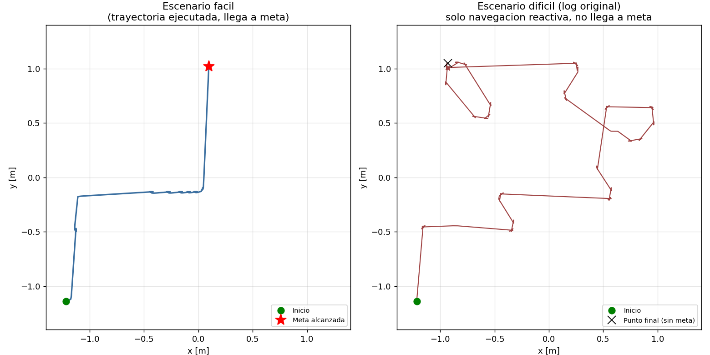

# Navegación Autónoma con Planificación de Rutas — e-puck en Webots

Proyecto Final · Robótica y Sistemas Autónomos (ICI 4150) · 2026-01
Docente: Sandra Cano

## Integrantes

Vicente Martinez, Dario Fuentes y Joaquin Cornejo


---

## 1. Línea seleccionada

**Línea A — Planificación de rutas.** El robot calcula una ruta global con A* sobre una grilla de ocupación 2D y la ejecuta mediante un seguidor de waypoints, con una capa reactiva de evitación de obstáculos que tiene prioridad sobre el plan cuando detecta riesgo de colisión.

## 2. Objetivo del proyecto

Que un robot diferencial e-puck navegue de forma autónoma desde una posición inicial hasta una meta dentro de un entorno con obstáculos, combinando:

- un plan global (A* sobre grilla de ocupación),
- una estimación de movimiento por odometría (encoders, con corrección opcional vía Supervisor),
- una capa reactiva de evitación de obstáculos basada en sensores de proximidad,
- filtrado de la señal del sensor frontal (media móvil y Kalman 1D) para mejorar la estabilidad de las decisiones.

## 3. Robot, sensores y actuadores

- **Robot:** e-puck (`E-puck.proto`, Webots R2025a), modo `supervisor TRUE` para poder leer la pose real durante la validación del sistema.
- **Actuadores:** dos motores diferenciales (`left wheel motor`, `right wheel motor`), velocidad máxima 6.28 rad/s.
- **Sensores:**
  - 8 sensores de proximidad infrarroja `ps0`–`ps7`. Se usan especialmente `ps0`/`ps7` (frontales) y `ps2`/`ps5` (laterales).
  - Encoders de posición angular de cada rueda (`left wheel sensor`, `right wheel sensor`), usados para odometría.
- **Parámetros físicos:** radio de rueda 0.0205 m, distancia entre ruedas 0.052 m, paso de simulación de 64 ms (≈15.6 Hz).

## 4. Arquitectura del controlador

El controlador `navegacion` se organiza en módulos independientes, cada uno con una responsabilidad única:

| Módulo | Responsabilidad |
|---|---|
| `config.py` | Parámetros físicos, umbrales, ganancias y constantes del sistema. |
| `sensors.py` | Lectura e indexado de los sensores de proximidad. |
| `differential_drive.py` | Inicialización de motores y encoders, escritura de velocidades. |
| `odometry.py` | Odometría diferencial (modelo cinemático del Laboratorio 1). |
| `filters.py` | Media móvil y filtro de Kalman 1D para la señal frontal. |
| `occupancy_grid.py` | Carga de la grilla desde CSV, conversión celda↔mundo, métricas de ruta. |
| `astar.py` | Planificación de ruta global (A*, 4 u 8 direcciones). |
| `waypoint_follower.py` | Control proporcional para seguir la ruta planificada. |
| `reactive_navigation.py` | Evitación de obstáculos con prioridad sobre el plan global. |
| `metrics_logger.py` | Registro de métricas por ciclo y exportación a CSV. |
| `navegacion.py` | Orquesta todo lo anterior en el loop principal de Webots. |

### Jerarquía de decisión (de mayor a menor prioridad)

1. **Maniobra de escape activa** (si ya se inició, se completa).
2. **Escape reactivo**: ante un sensor frontal o lateral por sobre el umbral crítico, el robot toma control de los motores y gira para alejarse.
3. **Centrado en pasillo**: si un sensor lateral detecta una pared cercana pero no crítica, se corrige la trayectoria proporcionalmente.
4. **Recuperación por bloqueo**: si el robot intenta avanzar pero no se desplaza durante varios ciclos seguidos (atascado), ejecuta retroceso + giro.
5. **Seguimiento de ruta (`WaypointFollower`)**: si no hay riesgo de colisión, el robot avanza hacia el siguiente waypoint de la ruta A*.
6. **Navegación reactiva pura**: si no hay plan global disponible (A* no encontró ruta), el robot navega solo por reglas reactivas.

## 5. Algoritmo de planificación: A*

- Grilla de ocupación 2D cargada desde un CSV (`0`=libre, `1`=obstáculo, `2`=inicio, `3`=meta).
- Heurística Manhattan para movimiento en 4 direcciones, Euclidiana para 8 direcciones.
- **Validación de esquinas en movimientos diagonales:** un movimiento diagonal solo se acepta si las dos celdas ortogonales que forman el vértice también están libres. Esto evita que la ruta "corte" la esquina de una pared — un problema que detectamos durante las pruebas del escenario difícil (ver sección 8).
- La ruta resultante se simplifica conservando solo los puntos de inflexión, y se convierte a coordenadas Webots para alimentar al `WaypointFollower`.

### Pseudocódigo simplificado

```
funcion astar(grilla, inicio, meta, tipo_movimiento):
    si inicio o meta fuera de limites o son obstaculo: devolver []

    frontera = cola_prioridad con (costo_estimado=0, inicio)
    costo_g[inicio] = 0

    mientras frontera no este vacia:
        actual = sacar el de menor costo_estimado de la frontera

        si actual == meta:
            devolver reconstruir_ruta()

        para cada vecino segun tipo_movimiento (4 u 8 direcciones):
            si vecino es obstaculo: continuar
            si el movimiento es diagonal y corta una esquina: continuar
            nuevo_costo = costo_g[actual] + costo_movimiento
            si nuevo_costo < costo_g[vecino] registrado:
                costo_g[vecino] = nuevo_costo
                costo_estimado = nuevo_costo + heuristica(vecino, meta)
                agregar vecino a la frontera
                came_from[vecino] = actual

    devolver []  # sin ruta posible
```

## 6. Relación con los Laboratorios 1 y 2

| Laboratorio | Qué se reutilizó | Dónde |
|---|---|---|
| **Lab 1 — Control cinemático diferencial** | Modelo `v, ω → vel_rueda_izq, vel_rueda_der` mediante cinemática inversa diferencial; control proporcional angular para girar hacia un punto objetivo. | `waypoint_follower.py` |
| **Lab 2 — Percepción y navegación reactiva** | Lectura de los 8 sensores de proximidad, lógica de evitación de obstáculos (giro, escape, centrado en pasillo). | `sensors.py`, `reactive_navigation.py` |
| **Lab 2 — Encoders y odometría** | Modelo cinemático directo a partir de `Δs` y `Δφ` de cada rueda (ecuaciones 3–7 de la pauta) para estimar `(x, y, θ)`. | `odometry.py` |
| **Lab 2 — Filtrado / fusión sensorial** | Media móvil y filtro de Kalman 1D aplicados a la señal frontal, fusionando la predicción por avance de encoders con la medición del sensor de proximidad. | `filters.py` |

El proyecto extiende estos aprendizajes agregando una capa de **navegación global** (grilla de ocupación + A*) que no existía en los laboratorios: ahora el robot no solo evita obstáculos, sino que primero decide *hacia dónde* ir y usa la capa reactiva como corrección y red de seguridad, no como única fuente de decisión.

## 7. Escenarios de prueba

| Escenario | Arena | Grilla | Tamaño de celda | Movimiento A* | Obstáculos |
|---|---|---|---|---|---|
| **Fácil** | 2.8 × 2.8 m | 14 × 14 | 0.2 m | 4 direcciones | Pasillo relativamente directo, pocos obstáculos |
| **Difícil** | 2.8 × 2.8 m | 28 × 28 | 0.1 m | 8 direcciones | ~36 obstáculos tipo pared (`DamascusSteel`, 0.4×0.1 m) formando un laberinto con pasillos estrechos y curvas |

Ambos escenarios comparten el mismo robot, controlador y arquitectura de decisión; solo cambian el archivo de grilla (`facil_grid.csv` / `dificil_grid.csv`) y los parámetros de grilla pasados por `controllerArgs`.

## 8. Resultados y métricas de desempeño

Métricas extraídas de los logs reales generados por `metrics_logger.py` (modo de decisión: **Kalman**).

### 8.1 Escenario fácil

| Métrica | Valor |
|---|---|
| Resultado | **Meta alcanzada** |
| Tiempo total | 90.11 s |
| Celdas de la ruta A* | 18 (4 waypoints tras simplificar) |
| Longitud de ruta planificada (4 dir., 0.2 m/celda) | ≈ 3.40 m |
| Longitud de trayectoria ejecutada (odometría/Supervisor) | 3.72 m |
| Diferencia plan vs. ejecutado | +0.32 m (≈ 9.5 % más larga) |
| Ciclos en escape reactivo (cuasi-colisión evitada) | 112 de 1408 (8.0 % del tiempo) |
| Ciclos en recuperación por bloqueo | 0 |
| Señal frontal (Kalman) | prom. 68.5, máx. 71.4, varianza 0.84 |
| Señal frontal cruda | prom. 67.1, máx. 78.0, varianza 5.58 |

El filtro de Kalman reduce la varianza de la señal frontal en casi 7× respecto a la señal cruda, lo que se traduce en decisiones de giro/avance más estables y menos oscilantes.

### 8.2 Escenario difícil

Durante la primera ronda de pruebas en el escenario difícil, **A\* no encontró ruta** (`ruta_celdas = 0` durante toda la corrida) porque la grilla CSV del escenario tenía filas incompletas y no contenía una celda de inicio válida. El robot operó únicamente con la capa reactiva durante 196 s, recorrió 10.58 m y **no alcanzó la meta**: quedó deambulando en la mitad superior de la arena.


*Izquierda: escenario fácil, con plan A*, llega a la meta. Derecha: escenario difícil con la grilla original, sin plan A* (solo reactivo), no llega a la meta.*

| Métrica (corrida original, sin plan A*) | Valor |
|---|---|
| Resultado | **No alcanza la meta** |
| Tiempo total | 196.16 s |
| Celdas de la ruta A* | 0 (sin plan) |
| Longitud de trayectoria ejecutada | 10.58 m |
| Ciclos en escape reactivo | 592 de 3065 (19.3 % del tiempo) |
| Señal frontal (Kalman) | prom. 79.9, **máx. 241.7**, varianza 621.2 |

El salto en la varianza y el máximo de la señal frontal frente al escenario fácil refleja directamente la mayor densidad de obstáculos y los pasillos estrechos del laberinto.

### 8.3 Depuración: de la falla al plan funcional

Se diagnosticaron y corrigieron dos problemas en cadena:

1. **`dificil_grid.csv` incompleto.** La grilla esperada para este escenario es de 28×28 celdas (arena 2.8 m / 0.1 m por celda), pero el CSV tenía solo 23 filas, la última truncada, y no incluía la celda de inicio (`2`). Esto provocaba un `ValueError` al cargar la grilla. Se reconstruyó la grilla completa a partir de las posiciones, rotaciones y tamaños reales de las 36 paredes definidas en el archivo de mundo `dificil.wbt`, validando con el robot Supervisor que la celda de inicio calculada coincidiera con una celda realmente libre.

2. **Cortes de esquina en el A* de 8 direcciones.** Una vez con la grilla corregida, A* sí encontraba ruta, pero algunos movimientos diagonales pasaban exactamente por el vértice de una pared (ej. de la celda (26,2) a (27,3) y luego a (26,4), "cortando" la esquina de un obstáculo en (26,3)). En la simulación esto se manifestaba como el robot rozando la esquina justo después de la salida y desviándose del plan. Se corrigió `astar.py` agregando una validación: un movimiento diagonal solo se acepta si ambas celdas ortogonales adyacentes a esa diagonal también están libres.

Tras ambas correcciones, A* sobre el escenario difícil encuentra una ruta de **39 celdas (≈4.34 m planificados)** sin ningún corte de esquina, frente a una ruta de 37 celdas que sí cortaba 5 esquinas antes del ajuste. El costo es un recorrido ligeramente más largo (+0.12 m) a cambio de eliminar el riesgo de colisión en los vértices.

> Pendiente para el repositorio final: volver a ejecutar el escenario difícil con `dificil_grid.csv` y `astar.py` corregidos, y agregar aquí el log/trayectoria de esa corrida exitosa para completar la comparación cuantitativa (tiempo total, longitud ejecutada, % de tiempo en modo reactivo).

## 9. Instrucciones para ejecutar la simulación

1. Abrir Webots (R2025a o compatible) y cargar el archivo de mundo correspondiente (`facil.wbt` o `dificil.wbt`).
2. Verificar que el robot E-puck tenga `controller "navegacion"`.
3. El argumento del controlador (`controllerArgs`) selecciona el escenario:
   - `["facil"]` → usa `facil_grid.csv`, grilla 14×14, A* en 4 direcciones.
   - `["dificil"]` → usa `dificil_grid.csv`, grilla 28×28, A* en 8 direcciones.
4. Ejecutar la simulación. Por consola se imprime el resumen de inicialización (modo de decisión, umbrales, tamaño de grilla, celda de inicio/meta, longitud estimada de ruta) y, cada 20 muestras, el estado del robot (odometría, señal frontal cruda/filtrada/Kalman, acción actual).
5. Al llegar a la meta (o si se detiene manualmente), se exporta un CSV con todas las métricas del recorrido a la carpeta `results/` en la raíz del proyecto, con nombre `log_<fecha-hora>_Mundo=<escenario>_Modo=<modo>.csv`.
6. El modo de decisión (`crudo`, `filtrado`, `kalman`) se cambia en `config.py` (`MODO_DECISION`).

## 10. Conclusiones, limitaciones y mejoras posibles

**Conclusiones**

- La combinación de planificación global (A*) con una capa reactiva de prioridad superior permite que el robot siga un plan eficiente sin perder la capacidad de reaccionar ante imprecisiones de la grilla o de la odometría.
- El filtro de Kalman reduce notablemente la varianza de la señal frontal frente a la lectura cruda, lo que estabiliza las decisiones de la capa reactiva y reduce giros innecesarios.
- La validación de movimientos diagonales en A* es crítica cuando se trabaja con grillas finas (0.1 m/celda): sin ella, el plan puede generar trayectorias que colisionan con esquinas de obstáculos aunque, celda por celda, cada paso individual sea "válido".

**Limitaciones**

- La calidad de la grilla de ocupación depende de una conversión manual/aproximada entre las dimensiones reales de los obstáculos en Webots y el tamaño de celda; errores de redondeo en los bordes pueden marcar como ocupada una celda que en la realidad está libre (o viceversa).
- La capa reactiva, al tomar control total de los motores durante un escape, puede alejar al robot del plan original; si el escape es largo o frecuente (como en el escenario difícil), el plan A* deja de ser representativo de la trayectoria real.
- No se implementó re-planificación dinámica: si el robot se aleja demasiado del plan, no se recalcula una nueva ruta A* desde la posición actual.

**Mejoras posibles**

- Re-ejecutar A* periódicamente desde la celda actual del robot cuando la distancia al waypoint activo supere un umbral, en lugar de seguir forzando el plan original.
- Suavizar la transición entre navegación reactiva y seguimiento de ruta para evitar cambios abruptos de velocidad al recuperar el control.
- Incorporar un margen de seguridad (inflado de obstáculos) en la grilla de ocupación, en vez de marcar únicamente las celdas estrictamente ocupadas, para dar más tolerancia al error de odometría.

---
